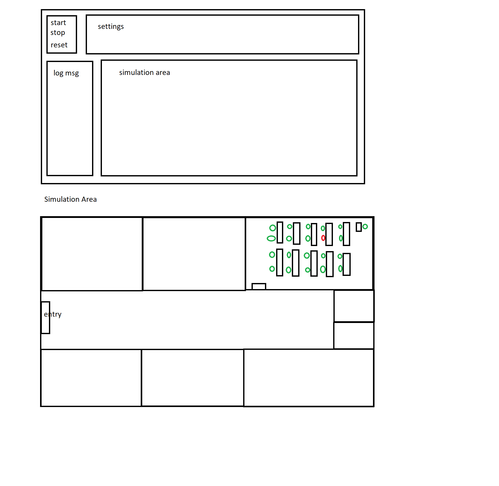

# Corona Extension feat Tscharnig

Simulation of a classroom

Idea:

- simulate everyday situation
- simulate a week of school ⇒ afterwards user can decide if he wants to simulate next week
- 5 classes (each 20 students ???) + teachers (8) chamber
- the teachers meet after each lesson in the teacher’s chamber
- entrance
- no 1:1 mapping between time in real life and simulation ⇒ longer breaks and skip lessons
- maybe toilet (if enough time)
- the user can change settings
    - percent infected at start
    - how usefull are the tests in %
    - percentage vaccinated (fix 50% lower chance of getting infected, if infected 50% less chance of infecting someone else)
    - toggle (% of people who break the rules):
        - masks
        - tests
        - windows

Potential problems:

- it might be boring, because with wrong settings nothing happens (nobody infected or everyone)

## Design

